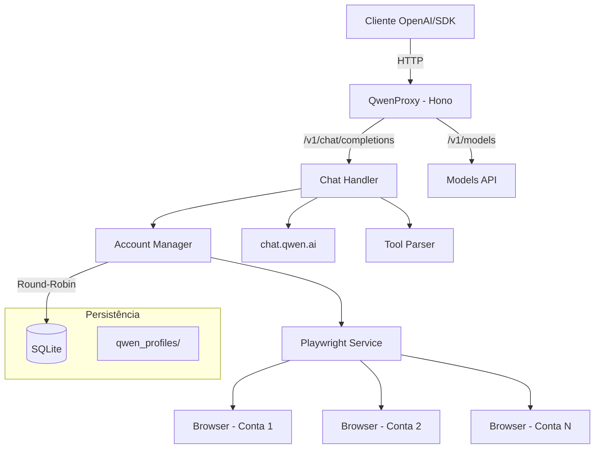

# QwenProxy

Proxy API local compatível com OpenAI que roteia requisições para os modelos do **Qwen (chat.qwen.ai)** via automação de navegador com Playwright. Suporte a múltiplas contas com rotação automática, execução de ferramentas, modo de pensamento (reasoning), persistência de sessão e armazenamento em SQLite.

[](https://github.com/arturwesley-jpg/ProxyQwen/actions/workflows/ci.yml)
[](https://www.typescriptlang.org/)
[](https://hono.dev/)
[](https://playwright.dev/)
[](LICENSE)

---

## Funcionalidades

- **API Compatível com OpenAI** — Interface compatível com `/v1/chat/completions` e `/v1/models`.
- **Multi-Conta** — Gerencie múltiplas contas Qwen com rotação round-robin e cooldown automático.
- **Armazenamento SQLite** — Contas salvas em banco de dados SQLite (modo WAL) para performance e confiabilidade.
- **Suporte a Reasoning** — Suporte completo ao modo de pensamento (thinking) dos modelos Qwen.
- **Execução de Ferramentas** — Sistema de execução de ferramentas locais integrado ao fluxo do chat.
- **Persistência de Sessão** — Perfil de navegador persistente por conta em `qwen_profiles/`.
- **Auto-Login** — Login automático via credenciais com recuperação de sessão.
- **Seleção de Navegador** — Escolha entre Chromium, Chrome, Firefox, Edge ou WebKit.
- **Monitoramento** — Health check, métricas Prometheus e watchdog integrados.
- **Pronto para Docker** — Deploy para VPS com Docker, volumes persistentes e graceful shutdown.

---

## Arquitetura



---

## Pré-requisitos

| Dependência | Versão Mínima | Instalação |
|------------|--------------|-----------|
| Node.js | v20.x | [nvm](https://github.com/nvm-sh/nvm) |
| npm | v9.x | Incluído com Node.js |
| Playwright | - | `npx playwright install` |
| Docker (opcional) | v24.x | [Docker Docs](https://docs.docker.com/get-docker/) |

---

## Instalação

### Via npm

```bash
git clone https://github.com/arturwesley-jpg/ProxyQwen.git
cd ProxyQwen
npm install
npx playwright install
```

### Via Docker

```bash
docker-compose up -d
```

---

## Configuração

Crie o arquivo `.env` na raiz do projeto (veja `.env.example`):

```env
# Porta do servidor (default: 3000)
PORT=3000

# Chave de API para proteger os endpoints (opcional)
API_KEY=sua-chave-secreta-aqui

# Credenciais Qwen para login automático (modo single-account)
QWEN_EMAIL=seu-email@exemplo.com
QWEN_PASSWORD=sua-senha-aqui

# Navegador (chromium, firefox, chrome, edge)
BROWSER=chromium
```

---

## Gerenciamento de Contas

As contas são armazenadas em SQLite (`data/qwenproxy.db`). Use o CLI interativo para gerenciar:

```bash
# Abrir o gerenciador de contas
npm run login

# Com navegador específico
npm run login:firefox
npm run login:chrome
npm run login:edge
```

O menu interativo permite:
- **[A]** Adicionar conta com credenciais (email + senha)
- **[M]** Adicionar conta via login manual no navegador
- **[R]** Remover uma conta
- **[L]** Login em todas as contas (inicializar sessões)

> Na primeira execução, se existir um `accounts.json` antigo, as contas serão migradas automaticamente para SQLite.

---

## Uso

### Iniciar o servidor

```bash
npm start                  # Chromium (padrão)
npm run start:chrome       # Google Chrome
npm run start:firefox      # Firefox
npm run start:edge         # Microsoft Edge
```

O servidor inicia em `http://localhost:3000` com as seguintes rotas:

| Rota | Método | Descrição |
|------|--------|-----------|
| `/v1/chat/completions` | POST | Chat completions (streaming + non-streaming) |
| `/v1/chat/completions/stop` | POST | Abortar uma geração ativa |
| `/v1/models` | GET | Listar modelos disponíveis |
| `/v1/models/:model` | GET | Informações de um modelo específico |
| `/health` | GET | Health check com status do sistema |
| `/metrics` | GET | Métricas no formato Prometheus |

---

## Exemplos de Integração

### OpenAI SDK (Node.js)

```typescript
import OpenAI from 'openai';

const openai = new OpenAI({
  baseURL: 'http://localhost:3000/v1',
  apiKey: process.env.API_KEY || 'sua-chave-aqui'
});

const completion = await openai.chat.completions.create({
  model: 'qwen-plus',
  messages: [{ role: 'user', content: 'Explique como funciona o Playwright.' }]
});

console.log(completion.choices[0].message.content);
```

### cURL

```bash
curl http://localhost:3000/v1/chat/completions \
  -H "Content-Type: application/json" \
  -H "Authorization: Bearer *** \
  -d '{
    "model": "qwen-plus",
    "messages": [{"role": "user", "content": "Olá!"}],
    "stream": true
  }'
```

---

## Deploy com Docker

### docker-compose.yml

```yaml
services:
  qwenproxy:
    build: .
    container_name: qwenproxy
    ports:
      - "${PORT:-3000}:3000"
    env_file:
      - .env
    volumes:
      - ./data:/app/data                    # Banco SQLite
      - ./qwen_profiles:/app/qwen_profiles  # Sessões dos navegadores
    restart: unless-stopped
```

### Volumes persistentes

| Volume | Conteúdo |
|--------|----------|
| `./data` | Banco SQLite com as contas (`qwenproxy.db`) |
| `./qwen_profiles` | Perfis de navegador por conta (cookies, sessões) |

---

## Execução Multi-Agente Paralela (S1+S2) ⚡

O QwenProxy suporta **execução paralela real de múltiplos agentes** via header `X-Account-Id`, permitindo que cada subagente use sua própria conta Qwen dedicada — eliminando contenção e permitindo throughput linear.

### Como Funciona

```
Hermes/Cliente → X-Account-Id: qwen-acc-01 → Conta: asdf20022026 (bd6d7b5a)
Hermes/Cliente → X-Account-Id: qwen-acc-02 → Conta: geen.trid02 (e091f929)
...
Hermes/Cliente → X-Account-Id: qwen-acc-08 → Conta: zxh00012026 (b8c03c82)
```

- **8 contas Outlook** = **8 slots paralelos máximos**
- **Account Pinning**: Cada requisição com `X-Account-Id` fixa na conta (FIFO queue, 30s timeout → 429)
- **Rotating Mode**: Sem header, round-robin com fail-fast para próxima conta livre
- **Mutex por conta**: `src/core/account-lock.ts` — Promise mutex com fila FIFO
- **Monitoramento**: `GET /v1/accounts/locks` mostra locks ativos

### Configuração Hermes (config-multiagent-snippet.yaml)

```yaml
custom_providers:
  - name: qwen-acc-01
    api_base: "http://SEU_VPS:3000/v1"
    api_key: "${API_KEY}"
    extra_headers:
      X-Account-Id: "qwen-acc-01"
  - name: qwen-acc-02
    api_base: "http://SEU_VPS:3000/v1"
    api_key: "${API_KEY}"
    extra_headers:
      X-Account-Id: "qwen-acc-02"
  # ... até qwen-acc-08
```

> Arquivos prontos: `~/.hermes/config-multiagent-snippet.yaml` e `~/.hermes/qwenproxy-accounts-map.txt`

---

## Otimizações de Performance (4 Fases) 🚀

### 1. Warm Pool Manager (`src/services/warm-pool.ts`)
- Pool de chats pré-aquecidos por conta (15 chats/conta)
- Refill proativo + TTL 30min
- Elimina cold-start latency

### 2. Chat Route Decomposição
`src/routes/chat.ts` → **7 módulos especializados** em `src/routes/chat/`:
| Módulo | Responsabilidade |
|--------|------------------|
| `parser.ts` | Parse/validação de requests OpenAI |
| `tool-mapper.ts` | Mapeamento de tool calls Qwen ↔ OpenAI |
| `auth.ts` | Autenticação + account selection |
| `session.ts` | Gestão de sessão Playwright |
| `stream.ts` | Streaming SSE + tool call streaming |
| `account-selector.ts` | Lógica pinned/rotating + lock |
| `stop.ts` | Cancelamento de geração ativa |

### 3. Semantic Cache HNSW O(log n) (`src/cache/semantic-cache-hnsw.ts`)
- **SimHash 64-bit** + **HNSW (Hierarchical Navigable Small World)**
- Busca approximate nearest neighbor em O(log n)
- Cache hits retornam `prompt_tokens: 0` (economia real de tokens)
- Persistência SQLite com batched writes

### 4. Model Router Data-Driven (`src/core/model-router.ts`)
- **Confidence scoring** por modelo/tarefa
- **EMA metrics** (Exponential Moving Average) de latência/sucesso
- **Async batched DB writes** (batch 10, flush 2s)
- **A/B testing 10%** — exploração automática
- **Fallback chain** — degradação graciosa

---

## Correção Crítica: Formato de Tool Calls 🔧

**Problema**: Modelos Qwen geravam tool calls malformados:
```json
{"name":"terminal"}\n{"command":"ls"}
```

**Solução**: *Aggressive format reinforcement* no **FINAL do system prompt** (não no meio) para TODOS contextos com tools:
- Exemplo de formato correto
- Exemplos **proibidos** (malformados)
- Regras numeradas de validação
- Aplicado em `src/routes/chat.ts` linhas ~263-280

> **Liçao**: "Lost in the Middle" — instruções de formatação no meio do prompt são ignoradas. **Sempre coloque no final**.

---

## Benchmarks Validados 📊

| Modelo | Latência Média | Tipo |
|--------|---------------|------|
| `qwen3.6-plus-no-thinking` | **~2.9s** | Fast (no reasoning) |
| `qwen3.6-plus` | ~8.5s | Thinking |
| `qwen3.6-max` | ~12s | Thinking |

- Modelos **no-thinking ~3x mais rápidos** que variants thinking
- VPS proxy em `147.15.134.189:3001` requer header `Authorization: Bearer ***`
- Commit `16d820f` contém S1+S2 + auto-reauth

---

## Estrutura do Projeto (Atualizada)

```
ProxyQwen/
├── src/
│   ├── index.ts                 # Entry point
│   ├── login.ts                 # CLI de gerenciamento de contas
│   ├── api/
│   │   ├── models.ts            # Endpoints /v1/models
│   │   └── server.ts            # Servidor Hono + startup
│   ├── cache/
│   │   ├── memory-cache.ts      # Cache em memória com TTL
│   │   └── semantic-cache-hnsw.ts  # Semantic Cache HNSW O(log n)
│   ├── core/
│   │   ├── account-lock.ts      # Per-account Promise mutex (S1+S2)
│   │   ├── account-manager.ts   # Rotação round-robin + cooldowns
│   │   ├── accounts.ts          # CRUD de contas (SQLite)
│   │   ├── circuit-breaker.ts   # Circuit breaker pattern
│   │   ├── config.ts            # Configuração com Zod
│   │   ├── database.ts          # Conexão e migrations SQLite
│   │   ├── logger.ts            # Logger estruturado
│   │   ├── metrics.ts           # Coleta de métricas
│   │   ├── model-registry.ts    # Registro de modelos e context windows
│   │   ├── model-router.ts      # Model Router data-driven
│   │   ├── rate-limiter.ts      # Rate limiting por conta
│   │   ├── stream-registry.ts   # Tracking de streams ativos
│   │   └── watchdog.ts          # Health monitoring
│   ├── routes/
│   │   ├── chat/                # Handler decomposto em 7 módulos
│   │   │   ├── index.ts         # Entry point + routing
│   │   │   ├── parser.ts        # Parse/validação requests
│   │   │   ├── tool-mapper.ts   # Mapeamento tool calls Qwen↔OpenAI
│   │   │   ├── auth.ts          # Auth + account selection
│   │   │   ├── session.ts       # Gestão sessão Playwright
│   │   │   ├── stream.ts        # Streaming SSE + tool calls
│   │   │   ├── account-selector.ts # Pinned/rotating logic
│   │   │   └── stop.ts          # Cancelamento geração ativa
│   │   └── upload.ts            # Handler /v1/upload (multimodal)
│   ├── services/
│   │   ├── playwright.ts        # Automação de navegador
│   │   ├── qwen.ts              # Integração com API do Qwen
│   │   └── warm-pool.ts         # Warm Pool Manager (15 chats/conta)
│   ├── tests/                   # Testes automatizados
│   ├── tools/
│   │   ├── parser.ts            # Parser de tags 